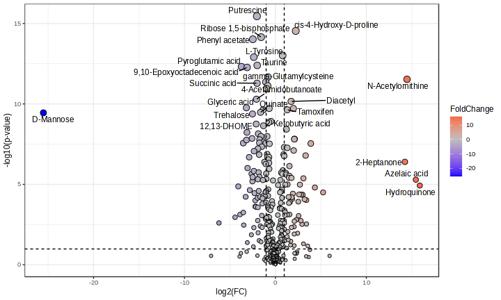

# Projeto Metabolômica no Câncer de Próstata

# Descrição Resumida do Projeto

### Câncer de Próstata 

Câncer é um termo que abrange mais de 200 diferentes doenças malignas, trazendo como característica geral o crescimento desordenado das células. O câncer apresenta uma origem multifatorial, através de mutações genéticas espontâneas ou induzidas (Neppel, 2017). A proliferação celular pode ser de forma controlada, originando as hiperplasias, metaplasias e displasias e caso esse crescimento ocorra de forma basicamente autônoma, ou seja, não controlada, temos as neoplasias, que são os cânceres *in situ* e os cânceres invasivos (INCA, 2020).

As neoplasias, que podem ser benignas ou malignas, se apresentam como uma fuga parcial ou total do controle do organismo, tendendo à autonomia e à perpetuação. Os tumores benignos se apresentam com limites bem nítidos e um crescimento de forma expansiva, organizada e lenta. Já os malignos, possuem maior grau de autonomia e resistência, possuindo a capacidade de invadir tecidos vizinhos, provocar metástases e a morte do hospedeiro (INCA, 2020).

O Instituto Nacional do Câncer estimou para o triênio de 2023 a 2025 um número de 483 mil novos casos de câncer, sendo o de próstata o mais frequente nos homens e o de mama nas mulheres. Além disso, o número estimado de casos de câncer de próstata, nesse mesmo período, é de 71730.

O câncer de próstata é o segundo tipo de câncer mais comum no mundo, apresentando-se como a segunda principal causa de morte entre os homens. Esse tipo de câncer apresenta a evolução lenta, dificultando o aparecimento de sintomas e a busca por exames diagnósticos.

A área oncológico-geniturinária tem enfrentado desafios acerca de diagnóstico não invasivo, menos perigoso e mais eficaz, e a integração entre as áreas da bioinformática, biotecnologia e bioquímica analítica, junto com os avanços da ciência, da pesquisa clínica e epidemiológica, mostra-se como uma solução para os problemas do diagnóstico. Um método que vem ganhando cada vez mais espaço nesse segmento oncológico, é a utilização da análise metabolômica, ou seja, a análise dos metabólitos intracelulares, a fim de reconhecer biomarcadores indicativos do câncer.

### Metabolômica

Os metabólitos são  qualquer substância química que desempenhe funções em uma determinada célula, seja através da sua ingestão ou síntese. Esses, representam a parte final do fluxo de informações dentro do organismo humano, demonstrando-se como a resposta final que o organismo irá apresentar à agentes externos.

Esses metabólitos são cruciais em grande parte das funções e reações intracelulares, sendo importantes para refletir o estado fisiológico de uma amostra coletada. Em razão de fatores de sensibilidade, são necessárias amostras multicelulares em métodos que utilizam ressonância magnética nuclear (RMN), apesar de que a heterogeneidade das células passe despercebida. Dessa forma, alguns estudos apresentaram que a metabolômica consegue fornecer informações com relação a heterogeneidade do tumor (Trock BJ, 2011).

O desequilíbrio do metabolismo está direto e fortemente relacionado com o desenvolvimento e progressão do câncer de próstata, de modo que o perfil usado na análise dos metabólitos seja muito atraído pelos marcadores deste tipo de câncer (Gomez-Cebrián, 2019). Um indivíduo com síndrome metabólica, apresenta uma próstata com concentrações altas dos marcadores de inflamação, o que pode favorecer o desenvolvimento do tumor. Já uma próstata saudável apresenta um metabolismo único na produção de PSA, espermina e citrato. Consequentemente, com um metaboloma específico gerado pelas alterações metabolômicas e exclusivas das células do câncer de próstata, os marcadores específicos acabam sendo um fácil alvo para os perfis metabolômicos e para sua captura (Kdadra M, 2019).

Os metabólitos exercem funções em todo o nicho "ômico", seja como mecanismo de modificação química metabólica das macromoléculas ou como mecanismo de interação entre o próprio metabólito e uma macromolécula determinada. Na atividade biológica dos metabólitos, há descobertas de que seu acúmulo module células cancerígenas através da interação existente entre proteína e proteína. Além de serem usados como marcadores tumorais, inibidores enzimáticos e modificadores de DNA, podem agir na proliferação de células cancerígenas por meio de alterações na atividade enzimática e na pós-tradução proteica.

  
# Slides

[link to slides](assets/METABOLOMICA_NO_CANCER_DE_PROSTATA_V2.pdf)

# Fundamentação Teórica

A proposta desse projeto é utilizar a teoria dos grafos e algoritmos de análise de rede para construir redes metabólicas e identificar os principais metabólitos e vias metabólicas associadas à progressão do câncer de próstata. Essa proposta tem como base o TCC do integrante Francisco Augusto Gomes Santos: Câncer de Próstata e Diagnóstico.

A metodologia aplicada foi baseada na seguinte publicação: Metabolomics and correlation network analyses of core biomarkers in type 2 diabetes (https://pubmed.ncbi.nlm.nih.gov/32930872/)

# Perguntas de Pesquisa

Objetivo: 

- Identificar os principais metabólitos e vias metabólicas associadas ao câncer de próstata.

Perguntas:

- Quais são os metabólitos candidatos a biomarcadores do câncer de próstata?
- Quais as funções desses metabólitos, e como estão relacionados com o desenvolvimento do câncer de próstata?

# Metodologia

1.  Obtenção de dados experimentais controle vs. câncer
2.  Análise estatística dos metabólitos: utilização de volcano plot
3.  Enriquecimento das vias metabólicas
4.  Construção de redes de correlação entre metabólitos
5.  Análise comparativa da topologia das duas redes: utilização de métodos como medidas de centralidade (betweenness, degree, eigenvector, closeness)
6.  Interpretação biológica dos achados 

## Bases de Dados e Evolução

> Base de Dados | Endereço na Web | Resumo descritivo
> ----- | ----- | -----
> Metabolights MTBLS6039 | https://www.ebi.ac.uk/metabolights/editor/MTBLS6039/files | Base de dados de um estudo contendo dados de 20 homens saudáveis e 60 pacientes com prostatite, HBP ou CaP que foram identificados usando cromatografia líquida não direcionada-espectrometria de massa (LC-MS). 
> KEGG PATHWAY Database | [http://base2.org/](https://www.kegg.jp/kegg/pathway.html) | KEGG é uma coleção de bancos de dados que tratam de genomas, vias biológicas, doenças, medicamentos e substâncias químicas.

1. Os dados utilizados no projeto foram obtidos do estudo *MTBLS6039: Serum organic acid metabolites can be used as potential biomarkers to identify prostatitis, benign prostatic hyperplasia, and prostate cancer (Untargeted assay)*, o qual apresenta dados de 80 participantes no total: 20 homens saudáveis e 60 pacientes com prostatite, HBP ou CaP. Para o projeto foram utilizados os dados dos participantes saudáveis e dos diagnosticados com o câncer de próstata. Esses dados foram obtidos através da técnica da cromatografia líquida acoplada à espectrometria de massas, e a partir do espectro de massas resultante do método, 411 metabólitos diferentes foram identificados.

2. Os dados foram filtrados e normalizados dentro da própria ferramenta MetaboAnalyst. Aplicou-se um filtro para remoção de dados (nesse caso, metabólitos) cuja variância nas amostras mostrou-se inferior a 10% do intervalo interquartil. Em sequência, as intensidades desses picos foram normalizadas: os dados foram centralizados na mediana, e a amplitude foi redimensionada para o intervalo [0, 1] usando-se os valores máximo e mínimo.

3. Para a seleção de metabólitos presentes somente nas cinco vias metabólicas significativamente alteradas, utilizou-se o banco de dados do KEGG. Os constituintes de cada uma dessas cinco vias foram usado para filtragem dos metabólitos diferenciais encontrados na análise estatística dos dados.

## Modelo Lógico

> 

## Evolução do Projeto

### 1. Obtenção de dados experimentais controle vs. câncer:

Foram obtidos os dados experimentais do controle vs. câncer de 40 participantes (20 saudáveis e 20 diagnosticados com câncer de próstata). Esses dados representam o espectro de massas obtido da cromatografia líquida acoplada à espectrometria de massas, que identificou 411 metabólitos diferentes.

### 2. Análise estatística dos metabólitos:

Para a realização de análise estatística dos metabólitos, a ferramenta MetaboAnalyst for usada para a determinação de metabólitos diferenciais entre indivíduos de cada condição. Para isso, foi consrtuído um volcano plot utilizando os dados dos 40 participantes, e a variação expressiva e significativa foi determinada para aqueles metabólitos que apresentaram log2(FC) > 2.0 e p value < 0.05. Nessa etapa, foram encontrados 133 metabólitos diferenciais.

### 3. Enriquecimento das vias metabólicas: 

Para essa etapa, também foi utilizada a ferramenta MetaboAnalyst. Para o enriquecimento das vias metabólicas, os 133 metabólitos encontrados anteriormente foram forncecidos e, ao todo, as seguintes vias foram identificadas como as mais afetadas pela super-representação desses compostos:

Nesta etapa do projeto, foram escolhidas as cinco primeiras vias que apresentaram p-value < 0.05, sendo elas:
  - Biossíntese da Arginina
  - Biossíntese de Valina, Leucina e Isoleucina
  - Metabolismo e Biossíntese de Fenilalanina, Tirosina e Triptofano
  - Metabolismo da Glutationa

### 4. Construção de redes de correlação: 

Foi calculada a correlação de Pearson entre os metabólitos diferenciais encontrados anteriormente, tanto para o grupo dos saudáveis, como no do câncer. Somente as interações entre metabólitos cuja correlação foi superior a 0.6 foram consideradas na construção das redes. A partir dessas correlações e dos metabólitos presentes nas cinco vias mais significativamente enriquecidas, duas redes de metabólitos foram construídas, uma para o grupo dos saudáveis, e outra para os do câncer. A ferramenta Neo4j foi utilizada para isso.

Uma vez que temos a rede de correlação, podemos ver quais são as vias mais expressivas na rede, ou seja, vias que mais se relacionam e, portanto, podem ser diferenciais para pacientes com câncer em vista do controle. Para buscar essa diferenciação, usamos as métricas de centralidade de cada nó.

Rede de participantes que apresentam Câncer de Próstata

Rede do grupo saudável:

### 5. Análise comparativa da topologia das duas redes: 

Para a análise comparativa, foi utilizada a ferramenta Cytoscape.

#### Análise da centralidade dos nós

Analisando a topologia do grafo, é possível avaliar a importância de cada nó, encontrando padrões em um conjunto de dados. Assim, 3 medidas de centralidade (Betweenness, Closeness e Eigenvector) foram calculadas em cada rede e, com isso, os metabólitos mais significativos em cada uma delas foram identificados:

Rede destacando, em vermelho, os metabólitos mais significativos no grupo de participantes com câncer, mas que se encontram pouco interligados no grupo dos:

Rede destacando, em rosa, com os metabólitos mais significativos no grupo de participantes saudáveis, mas pouco conectados na condição câncer:

## Análise Preliminar

#### Interpretação das vias metabólicas

- Biossíntese da Arginina: O metabolismo da arginina, um aminoácido condicionalmente essencial, desempenha um papel crucial na progressão e no prognóstico do câncer. Um estudo recente enfatizou que os genes de biossíntese de arginina estão associados à evasão imunológica em vários tipos de câncer ( Tan et al., 2024). Num estudo de cancer de prostata, o knockdown do prostate-specific membrane antigen (PSMA) pode inibir a proliferação e a metástase de células de CaP, bem como diminuir a expressão de receptor de andrógeno (AR) e promover a expressão de c-Fos e FosB por meio do aumento da biossíntese de arginina (Hong et al., 2022).
  
- Biossíntese deValina, Leucina e Isoleucina: Classicamente, o metabolismo do câncer tem se concentrado no metabolismo central do carbono, incluindo a glicólise e o ciclo do ácido tricarboxílico (ciclo do ácido cítrico, ciclo TCA). Os aminoácidos de cadeia ramificada (BCAAs; valina, leucina e isoleucina) são fontes alternativas de moléculas orgânicas que também podem alimentar o ciclo TCA (Liue et al., 2020)
  
- Metabolismo e biossíntese de Fenilalanina, Tirosina e Triptofano: Estudos revelaram que o metabolismo da fenilalanina junto com a biossíntese de fenilalanina, tirosina e triptofano  tem alto potencial como biomarcadores de câncer de próstata  (Akbari et al., 2021). Interessantemente esta via e estes metabólitos foram reportados como possíveis biomarcadores para câncer de mama ( Chen et al., 2021)

- Metabolismo da Glutationa: A glutationa é um antioxidante crucial na proteção contra o estresse oxidativo. Células cancerígenas frequentemente têm níveis elevados de glutationa para combater o estresse induzido pelo ambiente tumoral.

#### Interpretação dos metabólitos com importância nas análises comparativas

Metabólitos significativos na condição câncer, mas pouco significativos entre saudáveis:

- Ácido 2-cetobutírico: A presença de ácido 2-cetobutírico tem sido associada ao câncer de próstata por ele ser um intermediário no metabolismo da treonina e da cisteína, além de ser um marcador de estresse oxidativo e de disfunção mitocondrial.   
Nesse contexto, níveis elevados de ácido 2-cetobutírico podem indicar alterações no metabolismo para suportar seu rápido crescimento e sobrevivência.

- Gama-glutamilcisteína: Intermediária na síntese do glutationa, é um importante antioxidante celular que protege as células contra o extresse oxidativo e danos causados por radicais livres.
O aumento dos níveis de gama-glutamilcisteína pode refletir a maior atividade na via de síntese do glutationa, sugerindo que as células cancerígenas estão tentando se proteger contra danos oxidativos. Esse fenômeno pode estar relacionado à resistência ao tratamento e à progressão da doença.

- N-acetil-l-glutamato 5-semialdeído: Intermediário no metabolismo da prolina e da arginina, aminoácidos que desempenham papéis importantes no crescimento e na sobrevivência celular. Alterações no metabolismo desses aminoácidos podem ser indicativas de mudanças metabólicas que sustentam o crescimento e a proliferação das células cancerígenas.
Esse metabolismo alterado inclui a reprogramação das vias de síntese e degradação de aminoácidos.

- Ácido Piroglutâmico: Conhecido como 5-oxoprolina, também é um intermediário do metabolismo da glutationa. Como parte da via de síntese e degradação da glutationa, pode ter seus níveis aumentados em resposta à maior demanda por antioxidantes.

Metabólitos significativos na condição saudável, mas pouco significativos no câncer:

- L-threonina: É um aminoácido essencial e tem uma relação indireta, mas significativa, através de suas contribuições para processos celulares que podem afetar o crescimento e a sobrevivência das células cancerígenas. Atua na síntese de proteínas e no metabolismo celular, na produção de compostos bioativos, na resposta imune e na regulação da via da Glicina-Serina-Treonina.

- L-fenilalanina: Também é um aminoácido essencial e a relação da L-fenilalanina com a doença envolve várias vias metabólicas e funções biológicas que também podem influenciar o crescimento e a sobrevivência das células cancerígenas. Atua na síntese de proteínas, bem como na produção de neurotransmissores, no metabolismo e no controle ao estresse oxidativo e também em tratamentos realizados através de terapia com aminoácidos.

- L-fenilacetato: Composto derivado do metabolismo da fenilalanina e tem sido estudado por seu potencial terapêutico no tratamento de vários tipos de câncer. Envolve várias vias e mecanismos biológicos: indução da diferenciação celular, inibição da proliferação celular, modulação do metabolismo de glutamina, redução do estresse oxidativo e inibição de enzimas tumorais. 

# Ferramentas

- Python: processamento dos dados
- MetaboAnalyst (https://www.metaboanalyst.ca/): Análises estatísticas do dados, volcano plot, enriquecimento de vias
- Cytoscape
- Neo4j

# Referências Bibliográficas

NEPPEL, Tayonara Georgiane et al. CÂNCER: UMA DOENÇA MULTIFATORIAL1. PROPOSTAS DIDÁTICAS NA ABORDAGEM CIÊNCIA-TECNOLOGIA-SOCIEDADE: UMA PRODUÇÃO DO, p. 161.

MINISTÉRIO DA SAÚDE. INSTITUTO NACIONAL DO CÂNCER - INCA., 2020.

TROCK BJ. Application of metabolomics to prostate cancer. Urol Oncol. 2011 SepOct;29(5):572-81. doi: 10.1016/j.urolonc.2011.08.002. PMID: 21930089; PMCID: PMC3180907.

KDADRA M, Höckner S, Leung H, Kremer W, Schiffer E. Metabolomics Biomarkers of Prostate Cancer: A Systematic Review. Diagnostics (Basel). 2019 Feb 19;9(1):21. doi: 10.3390/diagnostics9010021. PMID: 30791464; PMCID: PMC6468767. KELL, Douglas B.; OLIVER, Stephen G. The metabolome 18 years on: a concept comes of age. Metabolomics, v. 12, n. 9, p. 1-8, 2016.

Wang JJ, Lei KF, Han F. Tumor microenvironment: recent advances in various cancer treatments. Eur Rev Med Pharmacol Sci. 2018

BRAY, Freddie et al. Estatísticas globais de câncer 2018: estimativas GLOBOCAN de incidência e mortalidade em todo o mundo para 36 cânceres em 185 países. CA: uma revista de câncer para clínicos, v. 68, n. 6, pág. 394-424, 2018.

CANUTO, Gisele AB et al. Metabolômica: definições, estado-da-arte e aplicações representativas. Química Nova, v. 41, p. 75-91, 2018.

ALBUQUERQUE NETO, Moacir Cavalcante de. Eficácia da análise metabonômica do soro de pacientes com câncer de próstata. 2021.

OLIVER, Stephen G. et al. Systematic functional analysis of the yeast genome. Trends in biotechnology, v. 16, n. 9, p. 373-378, 1998.

RINSCHEN, Markus M. et al. Identificação de metabólitos bioativos usando metabolômica de atividade. Nature Reviews Molecular Cell Biology, v. 20, n. 6, pág. 353-367, 2019.

YANG, Bo et al. Novel metabolic signatures of prostate cancer revealed by 1H-NMR metabolomics of urine. Diagnostics, v. 11, n. 2, p. 149, 2021.

GISKEØDEGÅRD, Guro F. et al. Metabolic markers in blood can separate prostate cancer from benign prostatic hyperplasia. British journal of cancer, v.113, n. 12, p.1712-1719, 2015.

SHAO Y, Ye G, Ren S, et al. Metabolomics and transcriptomics profiles reveal thedysregulation of the tricarboxylic acid cycle and related mechanisms in prostate cancer. Int J Cancer. 2018.

REN, Shancheng et al. Integration of metabolomics and transcriptomics reveals major metabolic pathways and potential biomarker involved in prostate cancer. Molecular&amp; Cellular Proteomics, v. 15, n. 1, p. 154-163, 2016.

LIMA, Ana Rita et al. NMR-based metabolomics studies of human prostate câncer tissue. Metabolomics, v. 14, n. 7, p. 1-11, 2018.

