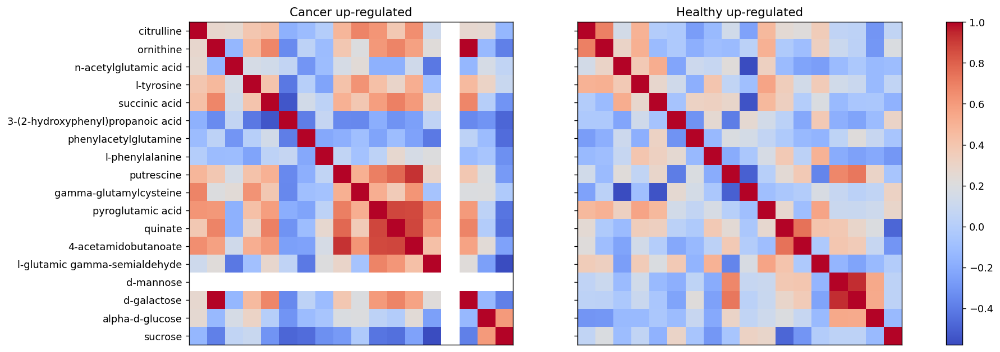
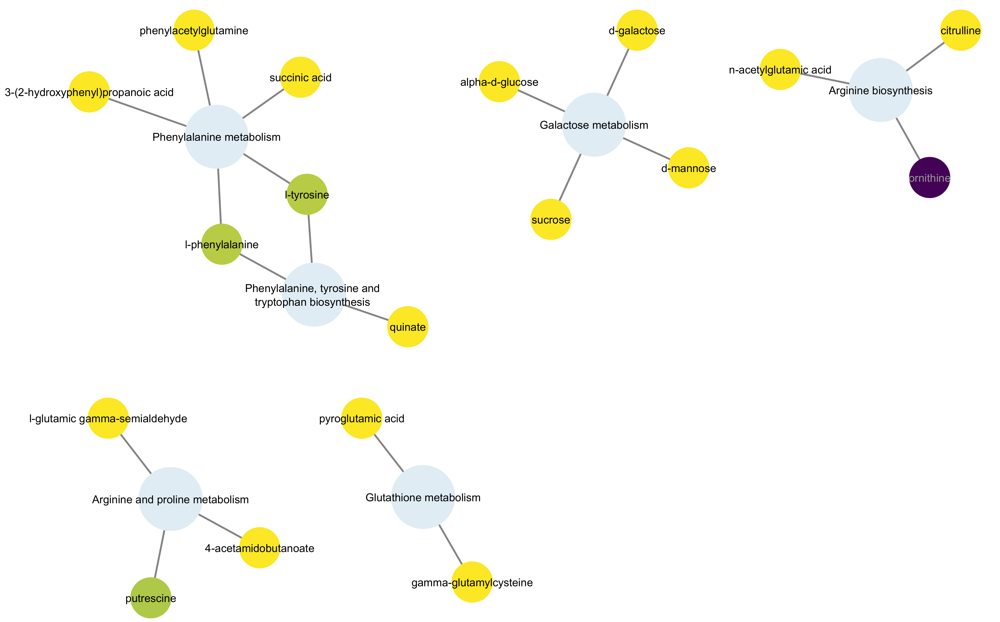

# Projeto Metabolômica no Câncer de Próstata

# Descrição Resumida do Projeto

> Descrição resumida do tema do projeto. Sugestão de roteiro (cada item tipicamente tratado em uma ou poucas frases):
>
> Contextualização do projeto
>
> Caracterização do problema
>
> Motivação
>
> Relevância
>

**Deixar mais claro como técnicas de rede vão contribuir**

### Câncer de Próstata 

Câncer é um termo que abrange mais de 200 diferentes doenças malignas, trazendo como característica geral o crescimento desordenado das células. O câncer apresenta uma origem multifatorial, através de mutações genéticas espontâneas ou induzidas (Neppel, 2017). A proliferação celular pode ser de forma controlada, originando as hiperplasias, metaplasias e displasias e caso esse crescimento ocorra de forma basicamente autônoma, ou seja, não controlada, temos as neoplasias, que são os cânceres *in situ* e os cânceres invasivos (INCA, 2020).

As neoplasias, que podem ser benignas ou malignas, se apresentam como uma fuga parcial ou total do controle do organismo, tendendo à autonomia e à perpetuação. Os tumores benignos se apresentam com limites bem nítidos e um crescimento de forma expansiva, organizada e lenta. Já os malignos, possuem maior grau de autonomia e resistência, possuindo a capacidade de invadir tecidos vizinhos, provocar metástases e a morte do hospedeiro (INCA, 2020).

O Instituto Nacional do Câncer estimou para o triênio de 2023 a 2025 um número de 483 mil novos casos de câncer, sendo o de próstata o mais frequente nos homens e o de mama nas mulheres. Além disso, o número estimado de casos de câncer de próstata, nesse mesmo período, é de 71730.

O câncer de próstata é o segundo tipo de câncer mais comum no mundo, apresentando-se como a segunda principal causa de morte entre os homens. Esse tipo de câncer apresenta a evolução lenta, dificultando o aparecimento de sintomas e a busca por exames diagnósticos.

### Metabolômica

Os metabólitos são  qualquer substância química que desempenhe funções em uma determinada célula, seja através da sua ingestão ou síntese. Esses, representam a parte final do fluxo de informações dentro do organismo humano, demonstrando-se como a resposta final que o organismo irá apresentar à agentes externos.

Esses metabólitos são cruciais em grande parte das funções e reações intracelulares, sendo importantes para refletir o estado fisiológico de uma amostra coletada. Em razão de fatores de sensibilidade, são necessárias amostras multicelulares em métodos que utilizam ressonância magnética nuclear (RMN), apesar de que a heterogeneidade das células passe despercebida. Dessa forma, alguns estudos apresentaram que a metabolômica consegue fornecer informações com relação a heterogeneidade do tumor (Trock BJ, 2011).

O desequilíbrio do metabolismo está direto e fortemente relacionado com o desenvolvimento e progressão do câncer de próstata, de modo que o perfil usado na análise dos metabólitos seja muito atraído pelos marcadores deste tipo de câncer (Gomez-Cebrián, 2019). Um indivíduo com síndrome metabólica, apresenta uma próstata com concentrações altas dos marcadores de inflamação, o que pode favorecer o desenvolvimento do tumor. Já uma próstata saudável apresenta um metabolismo único na produção de PSA, espermina e citrato. Consequentemente, com um metaboloma específico gerado pelas alterações metabolômicas e exclusivas das células do câncer de próstata, os marcadores específicos acabam sendo um fácil alvo para os perfis metabolômicos e para sua captura (Kdadra M, 2019).

Os metabólitos exercem funções em todo o nicho "ômico", seja como mecanismo de modificação química metabólica das macromoléculas ou como mecanismo de interação entre o próprio metabólito e uma macromolécula determinada. Na atividade biológica dos metabólitos, há descobertas de que seu acúmulo module células cancerígenas através da interação existente entre proteína e proteína. Além de serem usados como marcadores tumorais, inibidores enzimáticos e modificadores de DNA, podem agir na proliferação de células cancerígenas por meio de alterações na atividade enzimática e na pós-tradução proteica.

> Trabalhos relacionados
> 
> Indicação (bastante resumida) da análise proposta
>
> Indicação (bastante resumida) dos resultados alcançados

# Slides

> Coloque aqui o link para o PDF da apresentação da parte 3.

# Fundamentação Teórica

> Fundamentação teórica do problema em saúde/biologia. Cite artigos tomados como base e em que problema.

A proposta desse projeto é utilizar a teoria dos grafos e algoritmos de análise de redes para construir redes metabólicas e identificar os principais metabólitos e vias metabólicas associadas ao desenvolvimento do câncer de próstata. Essa proposta tem como base o TCC do integrante Francisco Augusto Gomes Santos: Câncer de Próstata e Diagnóstico.

A metodologia aplicada foi baseada na seguinte publicação: *Metabolomics and correlation network analyses of core biomarkers in type 2 diabetes* (https://pubmed.ncbi.nlm.nih.gov/32930872/), que fez a análise diferencial de redes de metabólitos relacionados à diabetes tipo 2.

# Perguntas de Pesquisa
> Perguntas de pesquisa (revisadas e atualizadas) que o projeto responde ou hipóteses que foram avaliadas, enunciadas de maneira objetiva e verificável.
> Apresente aqui como o projeto ajudou a responder as perguntas de pesquisa.

**Escolher como alvo coisas mais específicas relacionadas ao método**

 Objetivo: 

- Identificar os principais metabólitos e vias metabólicas associadas ao câncer de próstata.

Perguntas:

- Com base na análise topológica diferencial de redes de metabólitos na condição saudável e câncer de próstata, quais são os metabólitos candidatos a biomarcadores da doença?
- Quais as funções desses metabólitos, e como estão relacionados com o desenvolvimento do câncer de próstata?

# Metodologia
> Proposta de metodologia incluindo especificação de quais as técnicas/métricas de Ciência de Redes que estão sendo usadas no projeto,
> tais como: detecção de comunidades, análise de centralidade, predição de links, ou a combinação de uma ou mais técnicas. Descreva o que perguntas pretende endereçar com a técnica escolhida.

A metodologia adotada neste projeto foi inspirada no estudo realizado por XYZ, em que potenciais biomarcadores de diabetes tipo 2 foram identificados utilizando redes construídas a partir correlação entre metabólitos associados às vias enriquecidas e significativamente alteradas na doença. Para tanto, os seguintes passos foram considerados: 

1.  Obtenção de dados experimentais.
2.  Análise estatística dos metabólitos para identificação de diferenças entre o grupo saudável e o com câncer:
    - Utilização de *volcano plot* para separar os metabólitos com alterações significativas e expressivas em dois subgrupos:  sobre e sub-representados em indivíduos com câncer em relação aos saudáveis.
3.  Enriquecimento das vias metabólicas usando a Análise de Sobrerrepresentação em cada um dos subgrupos de metabólitos.
4.  Construção de quatro redes de correlação entre metabólitos associados às vias mais significativas:
    - Uma rede para cada condição (saudável ou câncer) em cada subgrupo de metabólitos (sobre ou sub-representado).
5.  Construção de duas redes de interação entre metabólitos e as vias metabólicas enriquecidas associadas a eles.
6.  Análise comparativa da topologia das redes:
    - Determinação dos principais metabólitos em cada rede com a análise de centralidade dos nós (*betweenness*, *degree*, *eigenvector*, *closeness*).
    - Detecção de comunidades de metabólitos, possivelmente pertencentes a uma mesma via metabólica ou com papel chave em mais de uma via, utilizando o algoritmo GLay.

Ao final do processo, os resultados das análises de cada rede foram interpretados do ponto de vista da biologia e dos mecanismos associados ao desenvolvimento do câncer de próstata.

## Bases de Dados e Evolução

> Para cada base, coloque uma entrada na tabela no modelo a seguir e depois detalhamento sobre como ela foi analisada/usada, conforme exemplo a seguir.

Base de Dados | Endereço na Web | Resumo descritivo
 ----- | ----- | -----
Metabolights MTBLS6039 | https://www.ebi.ac.uk/metabolights/editor/MTBLS6039/files | Base de dados de um estudo contendo dados de 20 homens saudáveis e 60 pacientes com prostatite, HBP ou CaP que foram identificados usando cromatografia líquida não direcionada-espectrometria de massa (LC-MS). 
KEGG PATHWAY Database | [http://base2.org/](https://www.kegg.jp/kegg/pathway.html) | KEGG é uma coleção de bancos de dados que tratam de genomas, vias biológicas, doenças, medicamentos e substâncias químicas.

> Faça uma descrição sobre o que concluiu sobre esta base. Sugere-se que respondam perguntas ou forneçam informações indicadas a seguir:
> * O que descobriu sobre essa base?
> * Quais as transformações e tratamentos (e.g., dados faltantes e limpeza) feitos?

Os dados utilizados no projeto foram obtidos do estudo *MTBLS6039: Serum organic acid metabolites can be used as potential biomarkers to identify prostatitis, benign prostatic hyperplasia, and prostate cancer (Untargeted assay)*, o qual apresenta dados de 80 participantes no total: 20 homens saudáveis e 60 pacientes com prostatite, HBP ou CaP. Para o projeto foram utilizados os dados dos participantes saudáveis e dos diagnosticados com o câncer de próstata. Esses dados foram obtidos através da técnica da cromatografia líquida acoplada à espectrometria de massas, e a partir do espectro de massas resultante do método, 411 metabólitos diferentes foram identificados.

Os dados foram filtrados e normalizados dentro da própria ferramenta *MetaboAnalyst*. Aplicou-se um filtro para remoção de dados (nesse caso, metabólitos) cuja variância nas amostras mostrou-se inferior a 10% do intervalo interquartil. Em sequência, as intensidades desses picos foram normalizadas: os dados foram centralizados na mediana, e a amplitude foi redimensionada para o intervalo [0, 1] usando-se os valores máximo e mínimo.

Para a seleção de metabólitos presentes somente nas vias metabólicas significativamente alteradas, utilizou-se o banco de dados do KEGG. Os constituintes de cada uma dessas vias foram usados para filtragem dos metabólitos diferenciais encontrados na análise estatística dos dados.

## Modelo Lógico

### Modelo lógico das redes de correlação:

|  |
| :--: |
| Figura 1. Modelo lógico para a rede homogênea formada por metabólitos. As arestas indicam o valor da correlação entre os metabólitos. |

### Modelo lógico das redes de interação entre metabólitos e as vias enriquecidas:

|  |
| :--: |
| Figura 2. Modelo lógico para a rede heterogênea formada por vias metabólicas ligadas aos metabólitos pertences a elas. |

## Análises Realizadas e Resultados

> Descrição dos resultados mais importantes obtidos.
>
> Apresente os resultados da forma mais rica possível, com gráficos e tabelas. Mesmo que o seu código rode online em um notebook, copie para esta parte a figura estática. A referência a código e links para execução online pode ser feita aqui ou na seção de Análises Realizadas (o que for mais pertinente).
> Apresente aqui uma análise dos dados.
> 
> Utilize gráficos que descrevam os aspectos principais da base que são relevantes para as perguntas de pesquisa consideradas.
>
> Nesta seção podem aparecer destaques de código como indicado a seguir. Note que foi usada uma técnica de highlight de código, que envolve colocar o nome da linguagem na abertura de um trecho com `~~~`, tal como `~~~python`.
>
> Os destaques de código devem ser trechos pequenos de poucas linhas, que estejam diretamente ligados a alguma explicação. Não utilize trechos extensos de código. Se algum código funcionar online (tal como um Jupyter Notebook), aqui pode haver links. No caso do Jupyter, preferencialmente para o Binder abrindo diretamente o notebook em questão.

~~~python
df = pd.read_excel("/content/drive/My Drive/Colab Notebooks/dataset.xlsx");
sns.set(color_codes=True);
sns.distplot(df.Hemoglobin);
plt.show();
~~~

### 1. Obtenção de dados experimentais controle vs. câncer

Os dados utilizados no projeto foram obtidos do estudo *MTBLS6039: Serum organic acid metabolites can be used as potential biomarkers to identify prostatitis, benign prostatic hyperplasia, and prostate cancer (Untargeted assay)*. A base de dados apresenta dados de 80 participantes, porém foram utlizados os dados de apenas 40 participantes, 20 do grupo controle (saudável) e 20 diagnosticados com câncer de próstata. Esses dados foram coletados no soro sanguíneo dos participantes e processados através da técnica da cromatografia líquida acoplada à espectrometria de massas, e a partir do espectro de massas resultante do método, 411 metabólitos diferentes foram identificados. Esses dados representam as intensidades dos picos correspondentes a cada um dos metabólitos identificados.

### 2. Análise estatística dos metabólitos

Com a ferramenta *MetaboAnalyst*, realizou-se a análise estatística univariada dos dados, que foram inicialmente filtrados e normalizados. Foram removidos os metabólitos cuja variância foi inferior a 10% do intervalo interquartil e a normalização utilizada foi a de centralização dos dados na mediana.

Após a filtragem e normalização desses dados, o *volcano plot* (Fig. 3) foi construído para determinação dos metabólitos que tiveram alterações significativas e expressivas entre os indivíduos de diferentes condições. Os metabólitos cujo valor do *log2(FC)* foi superior a 2 ou inferior a -2 e que tiveram p-valor inferior a 0.05 foram classificados como diferenciais.

|  |
| :--: |
| Figura 3. *Volcano plot* dos metabólitos entre as condições saudável e câncer de próstata. Para determinação daqueles mais significativos, foram adotados os critérios *log2(FC)* > 2 ou *log2(FC)* < 2 e p-valor < 0.05. |

Em sequência, os metabólitos foram divididos em dois subgrupos considerando o sinal do valor do *log2(FC)*: sobre, e sub-representados no grupo câncer em relação ao saudável, para valores positivos e negativos de *fold change*, respectivamente. Com isso, totalizam-se 133 metabólitos diferenciais, onde 56 estão sub-representados e 77, sobrerrepresentados.

### 3. Enriquecimento das vias metabólicas

As vias metabólicas associadas a partir dos dois subgrupos de metabólitos diferenciais foram determinadas com a Análise de Sobrerrepresentação de metabólitos, também na ferramenta *MetaboAnalyst*.

Cada subgrupo resultou em uma lista de vias enriquecidas: para os metabólitos sobrerrepresentados, as vias são mais ativas em indivídous com câncer do que em pessoas saudáveis, e para os sub-representados, vias que apresentam menor atividade em indivíduos com câncer. As Figuras 4 e 5 indicam os resultados do enriquecimento das vias para os metabólitos sub e sobrerrepresentados, respectivamente.

|  |
| :--: |
| Figura 4. Vias metabólicas sub-representadas no câncer de próstata. |

| |
| :--: |
| Figura 5. Vias metabólicas sobrerrepresentadas no câncer de próstata. |

As vias com maior significância, considerando p-valores inferiores a 0.05, foram selecionadas para análise em cada um dos subgrupos, sendo elas:

Vias metabólicas sub-representadas:

1. *Arginine biosynthesis*
2. *Pantothenate and CoA biosynthesis*
3. *Purine metabolism*
4. *Valine, leucine and isoleucine biosynthesis*
5. *Glycine, serine and threonine metabolism*
6. *D-Amino acid metabolism*

Vias metabólicas sobrerrepresentadas:

1. *Arginine biosynthesis*
2. *Phenylalanine metabolism*
3. *Glutathione metabolism*
4. *Phenylalanine, tyrosine and tryptophan biosynthesis*
5. *Arginine and proline metabolism*
6. *Galactose metabolism*

### 4. Redes de correlação entre metabólitos

As interações entre os metabólitos presentes em vias sub e sobrerrepresentadas no câncer de próstata foram avaliadas através de correlações entre eles, buscando identificar padrões que diferenciem os mecanismos subjacentes ao desenvolvimento da doença. Isso pode ocorrer tanto pela menor atividade (nas vias sub-representadas) quanto pela maior atividade (nas vias sobrerrepresentadas). Para determinar os metabólitos mais cruciais na integração e regulação das vias metabólicas associadas ao câncer, utilizou-se uma medida de centralidade composta, que inclui *betweenness*, *closeness* e *eigenvector*.

#### 4.1. Construção das redes

Como 6 vias metabólicas sobre, e 6 sub-representadas, foram selecionadas para análise, somente os metabólitos diferenciais associados a elas foram considerados nas redes de correlação. Para isso, o identificador *Compound ID*, presente tanto no KEGG, quanto no resultado do enriquecimento de vias, foi utilizado para filtragem dos dados. A base de dados final, que indica metabólitos significativamente alterados relacionados às vias enriquecidas, conta com 25 metabólitos associados às vias sub-representadas e 23 às vias sobrerrepresentadas.

Após essa filtragem, foi determinada a correlação de Pearson entre os metabólitos nos seguintes grupos:

- Presentes nas vias sub-representadas:
    - Em indivíduos saudáveis
    - Em indivíduos diagnosticados com câncer de próstata

- Presentes nas vias sobrerrepresentadas:
    - Em indivíduos saudáveis
    - Em indivíduos diagnosticados com câncer de próstata

As Figuras 6 e 7 representam, de forma visual, essas correlações:

|  |
| :--: |
| Figura 6. Correlação de Pearson entre os metabólitos das vias sub-representadas. |

|  |
| :--: |
| Figura 7. Correlação de Pearson entre os metabólitos das vias sobrerrepresentadas. |

Com isso, quatro redes de correlação entre metabólitos são construídas, nas quais os metabólitos são os nós, e a correlação entre eles, a aresta que os ligam, seguindo o modelo lógico indicado na Fig. 1. Para essa construção, cada uma das quatro matrizes de correlação tornou-se uma rede, e foram consideradas somente as arestas cujo valor de correlação foi superior a 0.6 ou inferior a -0.6. Este mesmo valor foi utilizado no artigo de referência. Outros valores foram testados, mas a densidade da rede resultante tornou inviável análises posteriores.

#### 4.2. Redes de correlação entre metabólitos em duas condições, para metabólitos sub e sobrerrepresentados.

As Figuras 8 e 9 ilustram as redes resultantes. Para cada par, os mesmos metabólitos estão presentes para facilitar a comparação visual das redes. As arestas em vermelho indicam correlações positivas e, as azuis, negativas. Nós em cinza indicam metabólitos que não fazem parte da rede, mas que foram incluídos para uma rápida diferenciação das duas condições. A escala de cores dos nós indica a centralidade de *betweenness* daquele metabólito.

|  |  |
| :--: | :--: |
| (a) Câncer de próstata | (b) Saudável |

Figura 8. Redes formadas por metabólitos sub-representados no câncer de próstata nas condições (a) câncer e (b) saudável. A escala de cores indica o valor da centralidade de *betweenness* do nó. Nós em cinza não fazem parte da rede, mas estão representados na figura para melhor comparação entre as duas condições.

|  |  |
| :--: | :--: |
| (a) Câncer de próstata | (b) Saudável |

Figura 9. Redes formadas por metabólitos sobrerrepresentados no câncer de próstata nas condições (a) câncer e (b) saudável.

### 5. Redes de interação entre metabólitos e as vias enriquecidas

Para entender como diferentes vias metabólicas se relacionam no câncer e como um metabólito pode afetar mais de uma via, duas redes em que vias metabólicas são associadas a seus metabólitos foram construídas, a primeira para as vias sub-representadas e a segunda, para as sobrerrepresentadas.

#### 5.1. Construção das redes

Os metabólitos pertencentes a cada uma das vias foram obtidos do KEGG, da mesma maneira como descrito na seção [4.1](#41-construção-das-redes).

Para a construção da rede, as seguintes bibliotecas de Python foram utilizadas:
- *gseapy*: foi utilizada para construção das relações entre vias e metabólitos de cada rede.
- *networkx*: utilizada para salvar cada rede como um arquivo gml.

#### 5.2. Redes de interação entre metabólitos e vias enriquecidas nos subgrupos sub e sobrerrepresentados.

As redes resultantes estão ilustradas nas Figuras 10 e 11. Nas figuras, as vias metabólicas são os nós maiores em cinza. A escala de cores dos metabólitos indica a centralidade de *betweenness*.

|  |
| :--: |
| Figura 10. Rede de interação entre os metabólitos das vias sub-representadas. |

|  |
| :--: |
| Figura 11. Rede de interação entre os metabólitos das vias sobrerrepresentadas. |

### 6. Análise comparativa da topologia das redes

#### 6.1. Análise topológica das redes de correlação

Para a análise diferencial das redes de correlação, inicialmente foram calculadas as seguintes medidas de centralidade para cada nó: *betweenness*, *closeness* e *eigenvector*. Os resultados foram condensados em um gráfico em que cada eixo indica uma das medidas, de modo que os metabólitos mais distantes da origem, de modo geral, são aqueles com as maiores medidas. As Figuras 12 e 13 apresentam esses resultados.

|  |  |
| :--: | :--: |
| (a) Câncer de próstata | (b) Saudável |

Figura 12. Centralidades de *betweenness*, *closeness* e *eigenvector* para os metabólitos sub-representados nas condições (a) câncer de próstata e (b) saudável. Observam-se como principais metabólitos *l-arginine* e *n-acetyl-l-glutamate 5-semialdehyde* no câncer, e *l-arginine*, *2-oxoarginine* e *diaminopimelic acid* nos indivíduos saudáveis.

|  |  |
| :--: | :--: |
| (a) Câncer de próstata | (b) Saudável |

Figura 13. Centralidades de *betweenness*, *closeness* e *eigenvector* para os metabólitos sobrerrepresentados nas condições (a) câncer de próstata e (b) saudável. Observam-se como principais metabólitos *4-acetamidobutanoate*, *pyroglutamic acid*, *quinate*, *gamma-glutamylcysteine* e *citrulline* no câncer, e *putrescine*, *d-galactose* e *d-mannose* nos indivíduos saudáveis.

Com base nesses resultados, os principais metabólitos em cada condição e em cada subgrupo são:

1. *l-arginine* e *n-acetyl-l-glutamate 5-semialdehyde*, sub-representados no câncer;
2. *l-arginine*, *2-oxoarginine* e *diaminopimelic acid*, sub-representados nos indivíduos saudáveis;
3. *4-acetamidobutanoate*, *pyroglutamic acid*, *quinate*, *gamma-glutamylcysteine* e *citrulline*, sobrerrepresentados no câncer;
4. *putrescine*, *d-galactose* e *d-mannose*, sobrerrepresentados nos indivíduos saudáveis.

As relações entre os nós são ilustradas em detalhes nas Figuras 14 e 15. Os nós em vermelho são aqueles significativos na rede e, consequentemente, os candidatos a biomarcadores do câncer de próstata.

|  |  |
| :--: | :--: |
| (a) Câncer de próstata | (b) Saudável |

Figura 14. Metabólitos de vias sub-representadas no câncer de próstata, significativamente mais correlacionados no grupo (a) câncer e (b) controle.

|  |  |
| :--: | :--: |
| (a) Câncer de próstata | (b) Saudável |

Figura 15. Metabólitos de vias sobrerrepresentadas no câncer de próstata, significativamente mais correlacionados no grupo (a) câncer e (b) controle.

#### 6.2. Análise diferencial das redes de correlação

Em sequência, realizou-se uma análise diferencial das redes, considerando cada um dos metabólitos significativos tanto na rede de indivíduos com câncer quanto na de indivíduos saudáveis. Essa análise avaliou as discrepâncias encontradas para cada metabólito entre as duas redes, incluindo diferenças nas conexões observadas entre os grupos com câncer e os saudáveis. As Figuras 16-20 apresentam essas diferenças em detalhes. Uma interpretação biológica dessas diferenças será apresentada na seção seguinte.

|  |  |
| :--: | :--: |
| (a) Câncer de próstata | (b) Saudável |

Figura 16. Diferença na conectividade de *n-acetyl-l-glutamate 5-semialdehyde* entre as condições (a) câncer e (b) saudável no subgrupo de metabólitos sub-representados. O metabólito encontra-se correlacionado a outros três no câncer, mas não apresenta relações significativas em indivíduos saudáveis.

|  |  |
| :--: | :--: |
| (a) Câncer de próstata | (b) Saudável |

Figura 17. Diferença na conectividade de *diaminopimelic acid* entre as condições (a) câncer e (b) saudável no subgrupo de metabólitos sub-representados. O *diaminopimelic acid* encontra-se em quantidades inferiores na doença e não apresenta relações significativas com outros metabólitos nessa condição, sugerindo que sua redução ou ausência pode estar relacionada com o câncer.

|  |  |
| :--: | :--: |
| (a) Câncer de próstata | (b) Saudável |

Figura 18. Diferença na conectividade de *pyroglutamic acid* entre as condições (a) câncer e (b) saudável no subgrupo de metabólitos sobrerrepresentados. O metabólito não apresenta relações significativas com outros metabólitos em indivíduos saudáveis, mas em pacientes diagnosticados com câncer, ele está ligado a outros oito compostos.

|  |  |
| :--: | :--: |
| (a) Câncer de próstata | (b) Saudável |

Figura 19. Diferença na conectividade de *4-acetamidobutanoate* entre as condições (a) câncer e (b) saudável no subgrupo de metabólitos sobrerrepresentados. O metabólito apresenta poucas relações significativas com outros metabólitos em indivíduos saudáveis, mas em pacientes diagnosticados com câncer, ele está ligado a outros oito metabólitos.

|  |  |
| :--: | :--: |
| (a) Câncer de próstata | (b) Saudável |

Figura 20. Diferença na conectividade de *gamma-glutamylcysteine* entre as condições (a) câncer e (b) saudável no subgrupo de metabólitos sobrerrepresentados. O metabólito interage de forma significativa somente em indivíduos com a doença.

#### 6.3. Clusterização das redes de correlação

O algoritmo GLay do Cytoscape foi utilizado para detecção de comunidades de metabólitos correlacionados. Os resultados dessa análise são apresentados nas Figuras 21 e 22. Dada a baixa densidade de conexões nas redes de correlação, somente em uma rede foi observada a formação de comunidades de metabólitos (Fig. 22a).

|  |  |
| :--: | :--: |
| (a) Câncer de próstata | (b) Saudável |

Figura 21. Não há formação de comunidades entre os metabólitos sub-representados no câncer de próstata. Cada módulo já estava presente na rede original em ambos os casos.

**Clusterização das redes das vias  sobrerrepresentadas:**

|  |  |
| :--: | :--: |
| (a) Câncer de próstata | (b) Saudável |

Figura 22. Três comunidades são formadas nos metabólitos sobrerrepresentados no câncer de próstata entre os indivíduos da condição (a) câncer.

#### 6.4. Análise topológica das redes de interação entre metabólitos e as vias enriquecidas

Com base na centralidade de *betweenness*, e pressupondo que nós com essa métrica elevada são aqueles que integram e regulam diferentes vias, por estarem no menor caminho entre elas, os seguintes metabólitos foram considerados mais significativos em cada rede:

1. Vias metabólicas sub-representadas:
    - *ornithine*
    - *putrescine*
    - *l-tyrosine*
    - *l-phenylalanine*

2. Vias metabólicas sobrerrepresentadas:
    - *l-arginine*
    - *2-oxoarginine*
    - *diaminopimelic acid*

A clusterização de cada rede utilizando o algoritmo GLay produziu as comunidades apresentadas nas Figuras 23 e 24.

|  |
| :--: |
| Figura 23. Comunidades detectadas nas vias metabólicas sub-representadas. Cada via se agrupou com seus próprios metabólitos, com exceção das vias de *Glycine, serine and threonine metabolism* e *Pantothenate and CoA biosynthesis*, que formaram um cluster único por compartilharem os metabólitos *l-cysteine* e *l-aspartic acid*. |

|  |
| :--: |
| Figura 24. Comunidades detectadas nas vias metabólicas sobrerrepresentadas. Novamente, cada via formou seu próprio cluster, com exceção de *Phenylalanine metabolism* e *Phenylalanine, tyrosine and tryptophan biosynthesis*, que foram agrupadas no mesmo cluster por compartilharem os metabólitos *l-phenylalanine* e *l-tyrosine*. |

### 7. Interpretação biológica e validação dos resultados com a literatura

#### 7.1. Análise das vias enriquecidas

1. Biossíntese de arginina
    - O metabolismo da arginina, um aminoácido condicionalmente essencial, desempenha um papel crucial na progressão e no prognóstico do câncer. Um estudo recente enfatizou que os genes de biossíntese de arginina estão associados à evasão imunológica em vários tipos de câncer (Tan et al., 2024). Num estudo de câncer de prostata, o *knockdown* do *prostate-specific membrane antigen* (PSMA) pode inibir a proliferação e a metástase de células de CaP (câncer de próstata), bem como diminuir a expressão de receptor de andrógeno (AR) e promover a expressão de c-Fos e FosB por meio do aumento da biossíntese de arginina (Hong et al., 2022).

2. Metabolismo de fenilalanina e Biossíntese de fenilalanina, tirosina e triptofano
    - Estudos revelaram que o metabolismo da fenilalanina junto com a biossíntese de fenilalanina, tirosina e triptofano têm alto potencial como biomarcadores de câncer de próstata (Akbari et al., 2021). Interessantemente esta via e estes metabólitos foram reportados como possíveis biomarcadores para câncer de mama (Chen et al., 2021).

3. Metabolismo da glutationa
    - A glutationa é um antioxidante crucial na proteção contra o estresse oxidativo. Células cancerígenas frequentemente têm níveis elevados de glutationa para combater o estresse induzido pelo ambiente tumoral.
    - Em 2020, foram reportados alguns casos em que os níveis dos principais antioxidantes, incluindo os grupos -SH e o glutationa (GSH), estão aumentando em doentes com CaP (câncer de próstata) em comparação com controles saudáveis (HC). Além disso, as enzimas relacionadas com a GSH, como a GSH peroxidase (GPx), a GST transferase (GST) e a GSH redutase (GR), podem estar diminuídas no CaP em comparação com os controles (Sajjaboontawee et al., 2020).

4. Metabolismo da galactose
    - Alterações no metabolismo de açúcares podem afetar a glicólise e a via das pentoses, essenciais para a produção de energia e precursores biossintéticos.
    - Num estudo de 1994, dois componentes do metabolismo de galactose foram reportados como possíveis biomarcadores em indivíduos com câncer de próstata, onde testaram a D-galactose-beta-[1-->3]-N-acetil-D-galactosamina na diferenciação entre as lesões benignas, malignas e pré-malignas da próstata (Shmasuddin and Beasley, 1994).

5. Biossíntese do pantotenato e CoA
    - O pantotenato é o precursor chave para a biossíntese da coenzima A (CoA) e das proteínas transportadoras que possuem um grupo protético fosfopanteína. O grupo fosfopanteína é doado a estas proteínas pela CoA e é utilizado para transportar intermediários entre os locais ativos das enzimas envolvidas na síntese de ácidos gordos, péptidos não ribossómicos e policetídeos. A CoA é um cofator essencial para o crescimento celular e está envolvida em muitas reações metabólicas, incluindo a síntese de fosfolípidos, a síntese e a degradação de ácidos gordos e o funcionamento do ciclo do ácido tricarboxílico. A formação pré-biótica e a estabilidade dos precursores do pantotenato sugerem que a função do CoA era importante nas primeiras vias metabólicas (Leonardi et al., 2007).

6. Metabolismo de purina
    - Purinas são componentes dos ácidos nucleicos (DNA e RNA). A demanda aumentada por purinas é uma característica comum das células cancerígenas, fornecendo nucleotídeos necessários para suportar a rápida proliferação.
    - **Os níveis de purinas nas células dos mamíferos são mantidos por uma ação coordenada das vias biossintéticas de recuperação e de novo .** Em condições fisiológicas normais, a maior parte do *pool* celular de purinas é derivada da reciclagem de bases degradadas através da via de recuperação. Além disso, as bases presentes na matriz extracelular podem ser transportadas para o interior da célula para gerar o nucleotídeo correspondente. Em condições celulares que exigem níveis mais elevados de purinas, a procura intracelular de purinas é satisfeita através da regulação positiva da via biossintética (Pedley et al., 2017).

7) Biossíntese de valina, leucina e isoleucina 
    - Classicamente, o metabolismo do câncer tem se concentrado no metabolismo central do carbono, incluindo a glicólise e o ciclo do ácido tricarboxílico (ciclo do ácido cítrico, ciclo TCA). Os aminoácidos de cadeia ramificada (BCAAs; valina, leucina e isoleucina) são fontes alternativas de moléculas orgânicas que também podem alimentar o ciclo TCA (Liue et al., 2020).

8) Metabolismo de D-aminoácidos
    - Os d-aminoácidos, os homólogos enantioméricos dos l-aminoácidos, foram durante muito tempo considerados não funcionais ou nem sequer presentes nos organismos vivos. Atualmente, reconhece-se que os d-aminoácidos desempenham papéis importantes em numerosos processos fisiológicos do corpo humano. A relação mais frequentemente estudada entre os d-aminoácidos e a fisiologia humana diz respeito à contribuição da d-serina e do d-aspartato para a neurotransmissão. Estes d-aminoácidos e vários outros foram também implicados na regulação da imunidade inata e na função de barreira intestinal. É importante notar que a presença de certos d-aminoácidos no corpo humano tem sido associada a várias doenças, incluindo a esquizofrenia, a esclerose lateral amiotrófica e doenças relacionadas com a idade, como a catarata e a aterosclerose. Além disso, há cada vez mais provas que sustentam um papel dos d-aminoácidos no desenvolvimento, na fisiopatologia e no tratamento de câncer (Bastings et al., 2019).

#### 7.2 Análise de metabólitos diferenciais

1. Metabólitos sub-representados no câncer 

    - Nas redes de correlação apresentadas, pode-se observar que o metabólito L-arginina está presente tanto em indivíduos saudáveis quanto em indivíduos com câncer e se encontraram sub, o que significa que eles estão presentes em poucas quantidades.

    - L-arginina
        - A L-arginina desempenha um papel importante no metabolismo de um organismo. Ela é o precursor da síntese de proteínas e de outras moléculas de grande importância biológica, incluindo óxido nítrico, ornitina, poliaminas, agmatina, prolina, glutamato, creatina, dimetilarginina e ureia (Scibior et al., 2004).
        - A L-arginina é conhecida também por ser um aminoácido proteinogênico e é essencial para a síntese de proteínas em células em proliferação ativa, como as células tumorais. Ela também está envolvida em outros processos metabólicos relacionados ao crescimento do tumor. Por outro lado, sabe-se que a atividade das células imunológicas também depende muito da biodisponibilidade da L-Arg. Portanto, o metabolismo da L-Arg tem um papel ambíguo na oncologia (Starikova et al., 2023).
    
    - 2-Oxoarginina
        - O 2-Oxoarginina é um metabólito composto guanidino do catabolismo da arginina. Num estudo este metabólito foi positivamente associado à secreção de insulina e pode estar mecanicamente relacionado aos resultados com a citrulina, em que a conversão de arginina em 2-oxoarginina é desviada de uma via de produção de óxido nítrico. Numa alteração do metabolismo da arginina (Palmer et al.,2018), alguns derivados podem estar associados com diversas condições patológicas, que incluem doenças metabólicas. 

    - Ácido diaminopimélico
        - O ácido diaminopimélico (DAP) pode ser encontrado na urina humana. Nos seres humanos, o sistema imunológico inato pode reconhecer componentes da parede celular bacteriana, inclusive o DAP. Os receptores do sistema imunológico, como os receptores NOD (*Nucleotide-binding Oligomerisation Domain*), podem detectar a presença de DAP, desencadeando respostas imunológicas para combater infecções bacterianas.

2. Metabólitos sobrerrepresentados nos saudáveis

    - Putrescina
        - Putrescina é uma poliamina também encontrada no sêmen. A expressão transgênica da **antizima** ornitina descarboxilase sugeriu que esta proteína única pode atuar como um supressor geral de tumor (https://hmdb.ca/metabolites/HMDB0001414).
        - Nos mamíferos, a putrescina é sintetizada no citoplasma como consequência da descarboxilação da ornitina, um aminoácido que não é encontrado nas proteínas e que é produzido como parte do ciclo da ureia que envolve enzimas citosólicas e mitocondriais. A putrescina é o precursor usado na biossíntese da espermidina e da espermina (Gerner et al., 2004).
        - Na próstata, o metabolismo da poliamina é importante, pois sintetiza e acumula os mais elevados níveis de poliaminas, principalmente espermina. A alta atividade secretora das células epiteliais luminais que circundam os ductos glandulares mantém um nível relativamente alto de espermina no fluido secretor de uma próstata saudável.

    - D-galactose e D-mannose
        - A D-Galactose é um nutriente fornecedor de energia e também um substrato básico necessário para a biossíntese de muitas macromoléculas no corpo. As vias metabólicas da D-galactose são importantes não apenas para o fornecimento destas vias, mas também para a prevenção da acumulação do metabólito da D-galactose. (https://hmdb.ca/metabolites/HMDB0000143)
        - D-Manose (também chamada de Manose ou D-manopiranose) é uma hexose ou um açúcar de seis carbonos. Também é classificada como uma aldohexose. É um monossacarídeo fermentável e um isômero da glicose. A manose comumente existe como dois anéis de tamanhos diferentes, a forma piranose (seis membros) e a forma furanose (cinco membros). (https://hmdb.ca/metabolites/HMDB0000169)
        - Para indivíduos saudáveis, tanto a D-galactose quanto a D-manose podem desempenhar papéis benéficos no metabolismo energético, na síntese de biomoléculas e na prevenção de infecções do trato urinário.

3. Metabólitos sub-representados no câncer 

    - *n-acetyl-l-glutamate 5-semialdehyde*
        - Intermediário no metabolismo da prolina e da arginina, aminoácidos que desempenham papéis importantes no crescimento e na sobrevivência celular. Alterações no metabolismo desses aminoácidos podem ser indicativas de mudanças metabólicas que sustentam o crescimento e a proliferação das células cancerígenas.
        - Esse metabolismo alterado inclui a reprogramação das vias de síntese e degradação de aminoácidos.
        - O glutamato é um aminoácido não essencial que pode ser sintetizado no corpo através de vias metabólicas distintas. O glutamato é sintetizado a partir de glutamina. Além de seu papel na síntese de metabólitos, o glutamato também serve como precursor para a biossíntese de aminoácidos como L-prolina e L-arginina (Yelamanchi et al., 2015).

4. Metabólitos sobrerrepresentados no câncer

    - 4-acetamidobutanoato
        - Reportado como um candidato a biomarcador validado, num análise conjunta de dados genômicos e metabolômicos e topologia de via usando passeio aleatório direcionado em um gráfico global de via gene-metabólito. o 4-acetamidobutanoato (um derivado do ácido gama-aminobutírico) foram metabolitos frequentemente seleccionados para discriminar o CaP (Câncer de próstata ) localizado do metastático (Kdadra et al.,2019).
        - Interessantemente este metabólito também foi reportado como associado a um alto risco de CO (Câncer de ovario): 4-acetamidobutanoato (OR = 1,78, IC 95%: 1,07-2,95, P = 0,026)(Liu et al., 2024).

    - Gama-glutamilcisteína
        - O sulforafano induz a expressão da subunidade leve da gama-glutamilcisteína sintetase, e esta indução está associada a aumentos moderados nos níveis de glutationa intracelular. Sulforafano induz expressão e atividade enzimática de fase 2 significativamente em células prostáticas humanas.
        - Reportada como intermediária na síntese do glutationa, é um importante antioxidante celular que protege as células contra o estresse oxidativo e danos causados por radicais livres.
        - O aumento dos níveis de gama-glutamilcisteína pode refletir a maior atividade na via de síntese do glutationa, sugerindo que as células cancerígenas estão tentando se proteger contra danos oxidativos. Esse fenômeno pode estar relacionado à resistência ao tratamento e à progressão da doença (Mulcahy et al., 1994)

    - Ácido piroglutâmico
        - Conhecido como 5-oxoprolina, também é um intermediário do metabolismo da glutationa. Como parte da via de síntese e degradação da glutationa, pode ter seus níveis aumentados em resposta à maior demanda por antioxidantes. Num estudo executaram dois modelos de diagnósticos onde distinguiram paciente  com  CaP ( Câncer de próstata) e dois metabólitos foram significantes o ácido fenilacético e ácido piroglutâmico  ( He et al., 2023)

    - Citrulina
        - Os resultados estratificados por tempo até o diagnóstico sugeriram que concentrações mais baixas de citrulina podem ser um marcador de câncer de próstata subclínico, já que a associação foi observada para doenças diagnosticadas nos primeiros anos após a coleta de sangue ( Schmidt et al.,2017)

## Evolução do Projeto

> Relatório de evolução, descrevendo as evoluções na modelagem do projeto, dificuldades enfrentadas, mudanças de rumo, melhorias e lições aprendidas. Referências aos diagramas, modelos e recortes de mudanças são bem-vindos.
> Podem ser apresentados destaques na evolução do modelo lógico. O modelo inicial e intermediários (quando relevantes) e explicação de refinamentos, mudanças ou evolução do projeto que fundamentaram as decisões.
> Relatar o processo para se alcançar os resultados é tão importante quanto os resultados.

### 1. Base de dados

Duas outras bases de dados foram utilizadas antes da definição do estudo utilizado neste projeto, ambas provenientes do repositório do *Metabolomics Workbench*:

1. Estudo **ST001042**: *Non-targeted serum metabolomic profiling of prostate cancer patients (FI-TWIM-MS PCa)*
    - O estudo apresentou dados de pacientes diagnosticados com câncer de próstata e indivíduos saudáveis, 103 participantes ao todo, mas os metabólitos não foram identificados, somente o espectro de massas com a relação massa/carga e a intensidade normalizada do pico foi disponibilizado.

2. Estudo **ST002498**:	*Plasma Metabolomics Profiling of 580 Patients from the Weill Cornell Medicine Early Detection Research Network Prostate Cancer Cohort*
    - O estudo contou com um número elevado de participantes em cada grupo e apresentou, além das concentrações dos metabólitos identificados, metadados relacionados à severidade da doença. No entanto, as análises estatísticas não revelaram diferenças interessantes entre os grupos. Os metabólitos que se apresentaram como diferenciais foram medicamentos utilizados pelos pacientes diagnosticados com a doença.

### 2. Modelo lógico

Um segundo modelo lógico foi acrescentado para análise das interações entre os metabólitos de diferentes vias metabólicas associadas ao câncer de próstata. 

### 3. Modelagem do problema

Os metabólitos diferenciais, identificados através da análise estatística no *MetaboAnalyst*, foram divididos em dois grupos: aqueles sub-representados e sobrerrepresentados no câncer de próstata em comparação aos indivíduos saudáveis. Isso permitiria uma análise mais detalhada quanto a direção das alterações metabólicas, tornando possível relacionar a doença a um aumento ou uma diminuição significativa desses metabólitos.

# Ferramentas

> Panorama das ferramentas utilizadas incluindo discussão sobre o uso das mesmas.

- Python: processamento dos dados
- MetaboAnalyst (https://www.metaboanalyst.ca/): Análises estatísticas do dados, volcano plot, enriquecimento de vias
- Cytoscape
- Neo4j

# Discussão

> Discussão dos resultados. Relacionar os resultados com as perguntas de pesquisa ou hipóteses avaliadas.
>
> A discussão dos resultados também pode ser feita opcionalmente na seção de Resultados, na medida em que os resultados são apresentados. Aspectos importantes a serem discutidos:
> Por que seu modelo alcançou (ou não) um bom resultado?
> É possível tirar conclusões dos resultados? Quais?
> Há indicações de direções para estudo?
> São necessários trabalhos mais profundos?

A arginina é um aminoácido semi-essencial envolvido em diversas funções biológicas vitais, incluindo a síntese de proteínas, a produção de óxido nítrico (NO), e o ciclo da ureia. Recentemente, a arginina tem sido estudada como um biomarcador potencial para várias doenças, incluindo o câncer, devido às suas múltiplas funções no metabolismo celular e seu papel nas vias bioquímicas alteradas em estados patológicos.

## Uso da Arginina como Biomarcador no Câncer

### Técnicas Metabolômicas
A metabolômica é o estudo sistemático dos perfis de metabólitos em células, tecidos ou organismos. Utilizando técnicas avançadas como a espectrometria de massa (MS) e a ressonância magnética nuclear (NMR), é possível identificar e quantificar pequenos metabólitos presentes em amostras biológicas. No contexto do câncer, as células tumorais apresentam metabolismos alterados para suportar o rápido crescimento e a proliferação celular, e a arginina desempenha um papel crucial nesses processos.

### Alterações Metabólicas no Câncer
Células cancerígenas frequentemente exibem alterações no metabolismo da arginina. Essas células podem aumentar a captação e a utilização da arginina para:
- Produção de Proteínas: O aumento da síntese proteica é necessário para suportar a proliferação celular.
- Produção de Óxido Nítrico (NO): O NO é um mediador importante em diversos processos, incluindo a vasodilatação e a sinalização celular. Em células cancerígenas, níveis alterados de NO podem influenciar a angiogênese (formação de novos vasos sanguíneos) e a progressão tumoral.
- Ciclo da Ureia: A arginina é um intermediário no ciclo da ureia, que remove amônia tóxica do corpo. Alterações nesse ciclo podem indicar disfunção metabólica associada ao câncer.

## Arginina como Biomarcador no Câncer de Próstata

### Metabolismo da Arginina no Câncer de Próstata
No câncer de próstata, o metabolismo da arginina é frequentemente alterado. A próstata tem uma atividade elevada da enzima arginase, que converte a arginina em ornitina e ureia. Estudos mostraram que níveis elevados de arginase e a depleção de arginina estão associados ao crescimento tumoral e à progressão do câncer de próstata. Além disso, a produção de poliaminas, que são derivadas da ornitina, também está aumentada. As poliaminas são críticas para a síntese de DNA e a proliferação celular, processos que estão desregulados em células cancerígenas.

### Vias Metabólicas Relevantes
- Ciclo da Ureia: Na próstata, a arginina é convertida em ornitina e ureia pela arginase. Ornitina é então utilizada na produção de poliaminas (putrescina, espermidina e espermina), que são essenciais para o crescimento celular e a estabilização do DNA.
- Síntese de Óxido Nítrico: A arginina é substrato para a síntese de NO pela enzima óxido nítrico sintase (NOS). O NO pode atuar tanto na promoção da angiogênese quanto na modulação do sistema imune, influenciando a microambiente tumoral.
- Produção de Poliaminas: Ornitina, derivada da arginina, é um precursor para poliaminas, moléculas importantes para a proliferação e diferenciação celular. A regulação da síntese de poliaminas é frequentemente alterada no câncer de próstata.

## Justificativa da Arginina como Biomarcador
A concentração de arginina e seus metabólitos no sangue, urina ou tecidos pode refletir o estado metabólico das células prostáticas. Técnicas metabolômicas permitem a análise detalhada desses metabólitos, fornecendo informações valiosas sobre o estado do câncer. Especificamente no câncer de próstata, a depleção de arginina e o aumento dos níveis de ornitina e poliaminas podem ser indicativos da atividade tumoral e da agressividade da doença.

# Conclusão
No desenvolvimento do nosso projeto, partimos de um estudo inicial que identificou possíveis marcadores para o câncer de próstata, com destaque para a colina. Este primeiro trabalho foi fundamental para estabelecermos uma base sólida e direcionarmos nossa pesquisa para a detecção de biomarcadores eficazes e específicos na identificação precoce e no monitoramento do câncer de próstata.

A colina, inicialmente identificada como um marcador potencial, desempenha um papel crucial no metabolismo celular, especialmente na síntese de fosfolipídios que compõem as membranas celulares. Estudos anteriores demonstraram que níveis elevados de colina estão associados ao crescimento celular descontrolado, característica comum em células cancerígenas. Assim, a identificação da colina serviu como um ponto de partida relevante para nossa investigação.

No decorrer do projeto, ampliamos a pesquisa para explorar outros possíveis biomarcadores e técnicas analíticas. Esse aprofundamento levou à identificação da arginina como um marcador promissor para o câncer de próstata. A arginina é um aminoácido essencial envolvido em diversos processos metabólicos, incluindo a síntese de proteínas e a produção de óxido nítrico. Alterações nos níveis de arginina podem indicar desregulações metabólicas frequentemente observadas em condições patológicas, como o câncer.

A relação entre a colina e a arginina reside na sua conexão com o metabolismo celular e a proliferação das células cancerígenas. Enquanto a colina está mais diretamente associada à síntese de fosfolipídios e ao crescimento celular, a arginina participa de vias metabólicas que influenciam a síntese proteica e a sinalização celular. Ambas as moléculas, portanto, refletem alterações metabólicas significativas que ocorrem em células malignas.

A transição da ideia inicial retirada de um TCC para o desenvolvimento final do nosso projeto, tendo a arginina como principal marcador final demonstra a evolução da pesquisa e a ampliação do nosso entendimento sobre os biomarcadores do câncer de próstata. Embora a primeira ideia tenha fornecido uma base inicial valiosa, a identificação da arginina, através das técnicas aprendidas no decorrer da disciplina, como marcador principal no trabalho final representa um avanço significativo, possivelmente oferecendo maior especificidade e sensibilidade para a detecção do câncer de próstata.

Essa mudança não apenas reflete uma progressão natural da pesquisa científica, mas também sublinha a importância de uma abordagem abrangente na busca por marcadores biológicos confiáveis. A integração de diferentes biomarcadores, como a colina e a arginina, pode oferecer uma visão mais completa e precisa do estado patológico, contribuindo para diagnósticos mais eficazes e tratamentos personalizados no combate ao câncer de próstata.

> Destacar as principais conclusões obtidas no desenvolvimento do projeto.
>
> Destacar os principais desafios enfrentados.
>
> Principais lições aprendidas.

A arginina é um potencial biomarcador do câncer devido ao seu papel central em diversas vias metabólicas que são frequentemente alteradas em estados cancerígenos. No câncer de próstata, as mudanças no metabolismo da arginina podem fornecer insights sobre a progressão do tumor e a eficácia do tratamento. As técnicas metabolômicas, ao oferecer uma visão detalhada dos perfis metabólicos, são ferramentas poderosas para a identificação de biomarcadores como a arginina, auxiliando no diagnóstico, prognóstico e monitoramento terapêutico do câncer de próstata.

Além da arginina, durante a análise das vias com a ferramenta KEGG, observou-se que na via da biossíntese de pantotenato e coenzima A, as vias do metabolismo de arginina e prolina também estão envolvidas. Um dos produtos intermediários dessas vias, a espermidina, faz parte do metabolismo que gera acetil-CoA. Outra via importante identificada foi o metabolismo de aminoácidos D, que inclui componentes como o metabolismo de fenilalanina, arginina e prolina, além do metabolismo de glicina, serina e treonina.

Na análise realizada, há evidência de metabólitos previamente descritos, os quais foram identificados através das medidas de centralidade. Isso demonstra a importância dessas métricas na identificação de metabólitos potenciais para biomarcadores no câncer de próstata. Recomenda-se estudos funcionais em nível clínico para validar essas informações.

Como desafios enfrentados durante o projeto, dois se destacam: (1) obtenção de dados e (2) o uso de ferramentas da metabolômica. Poucos estudos com fins similares foram encontrados, e muitos não disponibilizaram os dados. Embora a base utilizada neste estudo tenha um número limitado de participantes, é a única encontrada que satisfez os requisitos para avanço do projeto. Finalmente, ferramentas que trabalham com e integram dados de metabolômica foram encontradas com dificuldade. Além disso, há pouca documentação sobre como utilizá-las.

# Trabalhos Futuros

> O que poderia ser melhorado se houvesse mais tempo?
> Quais possíveis desdobramentos este projeto pode ter?

Como trabalhos futuros, duas possibilidades são apresentasdas: (1) aprofundamento das análises e (2) integração com outras ômicas. 

> Aprofundamento das análises de relação entre metabólitos, vias metabólicas e o câncer de próstata para melhor entender os mecanismos de desenvolvimento da doença. Integração com dados de proteínas e/ou genes associados ao câncer de próstata.

# Referências Bibliográficas

> Lista de artigos, links e referências bibliográficas.
>
> Fiquem à vontade para escolher o padrão de referenciamento preferido pelo grupo.

NEPPEL, Tayonara Georgiane et al. CÂNCER: UMA DOENÇA MULTIFATORIAL1. PROPOSTAS DIDÁTICAS NA ABORDAGEM CIÊNCIA-TECNOLOGIA-SOCIEDADE: UMA PRODUÇÃO DO, p. 161.

MINISTÉRIO DA SAÚDE. INSTITUTO NACIONAL DO CÂNCER - INCA., 2020.

TROCK BJ. Application of metabolomics to prostate cancer. Urol Oncol. 2011 SepOct;29(5):572-81. doi: 10.1016/j.urolonc.2011.08.002. PMID: 21930089; PMCID: PMC3180907.

KDADRA M, Höckner S, Leung H, Kremer W, Schiffer E. Metabolomics Biomarkers of Prostate Cancer: A Systematic Review. Diagnostics (Basel). 2019 Feb 19;9(1):21. doi: 10.3390/diagnostics9010021. PMID: 30791464; PMCID: PMC6468767. KELL, Douglas B.; OLIVER, Stephen G. The metabolome 18 years on: a concept comes of age. Metabolomics, v. 12, n. 9, p. 1-8, 2016.

Wang JJ, Lei KF, Han F. Tumor microenvironment: recent advances in various cancer treatments. Eur Rev Med Pharmacol Sci. 2018

BRAY, Freddie et al. Estatísticas globais de câncer 2018: estimativas GLOBOCAN de incidência e mortalidade em todo o mundo para 36 cânceres em 185 países. CA: uma revista de câncer para clínicos, v. 68, n. 6, pág. 394-424, 2018.

CANUTO, Gisele AB et al. Metabolômica: definições, estado-da-arte e aplicações representativas. Química Nova, v. 41, p. 75-91, 2018.

ALBUQUERQUE NETO, Moacir Cavalcante de. Eficácia da análise metabonômica do soro de pacientes com câncer de próstata. 2021.

OLIVER, Stephen G. et al. Systematic functional analysis of the yeast genome. Trends in biotechnology, v. 16, n. 9, p. 373-378, 1998.

RINSCHEN, Markus M. et al. Identificação de metabólitos bioativos usando metabolômica de atividade. Nature Reviews Molecular Cell Biology, v. 20, n. 6, pág. 353-367, 2019.

YANG, Bo et al. Novel metabolic signatures of prostate cancer revealed by 1H-NMR metabolomics of urine. Diagnostics, v. 11, n. 2, p. 149, 2021.

GISKEØDEGÅRD, Guro F. et al. Metabolic markers in blood can separate prostate cancer from benign prostatic hyperplasia. British journal of cancer, v.113, n. 12, p.1712-1719, 2015.

SHAO Y, Ye G, Ren S, et al. Metabolomics and transcriptomics profiles reveal thedysregulation of the tricarboxylic acid cycle and related mechanisms in prostate cancer. Int J Cancer. 2018.

REN, Shancheng et al. Integration of metabolomics and transcriptomics reveals major metabolic pathways and potential biomarker involved in prostate cancer. Molecular&amp; Cellular Proteomics, v. 15, n. 1, p. 154-163, 2016.

LIMA, Ana Rita et al. NMR-based metabolomics studies of human prostate câncer tissue. Metabolomics, v. 14, n. 7, p. 1-11, 2018.

Akbari Z, Dijojin RT, Zamani Z, Hosseini RH, Arjmand M. Aromatic amino acids play a harmonizing role in prostate cancer: A metabolomics-based cross-sectional study. Int J Reprod Biomed. 2021 Sep 9;19(8):741-750. doi: 10.18502/ijrm.v19i8.9622. PMID: 34568735; PMCID: PMC8458921.

Bastings JJAJ, van Eijk HM, Olde Damink SW, Rensen SS. d-amino Acids in Health and Disease: A Focus on Cancer. Nutrients. 2019 Sep 12;11(9):2205. doi: 10.3390/nu11092205. PMID: 31547425; PMCID: PMC6770864.

Chen, J., Liu, X., Shen, L., Lin, Y., & Shen, B. (2021). CMBD: a manually curated cancer metabolic biomarker knowledge database. Database : the journal of biological databases and curation, 2021, baaa094. https://doi.org/10.1093/database/baaa094

Gerner, E., Meyskens, F. Polyamines and cancer: old molecules, new understanding. Nat Rev Cancer 4, 781–792 (2004). https://doi.org/10.1038/nrc1454

He J, Han Z, Luo W, Shen J, Xie F, Liao L, Zou G, Luo X, Guo Z, Li Y, Li J, Chen H. Serum organic acid metabolites can be used as potential biomarkers to identify prostatitis, benign prostatic hyperplasia, and prostate cancer. Front Immunol. 2023 Jan 4;13:998447. doi: 10.3389/fimmu.2022.998447. PMID: 36685547; PMCID: PMC9846500.

Hong, X., Mao, L., Xu, L., Hu, Q., & Jia, R. (2022). Prostate-specific membrane antigen modulates the progression of prostate cancer by regulating the synthesis of arginine and proline and the expression of androgen receptors and Fos proto-oncogenes. Bioengineered, 13(1), 995–1012. https://doi.org/10.1080/21655979.2021.2016086

Kdadra M, Höckner S, Leung H, Kremer W, Schiffer E. Metabolomics Biomarkers of Prostate Cancer: A Systematic Review. Diagnostics (Basel). 2019 Feb 19;9(1):21. doi: 10.3390/diagnostics9010021. PMID: 30791464; PMCID: PMC6468767.

Liu, S., Ding, D., Liu, F. et al. Exploring the causal role of multiple metabolites on ovarian cancer: a two sample Mendelian randomization study. J Ovarian Res 17, 22 (2024). https://doi.org/10.1186/s13048-023-01340-w
Mulcahy, R. T., Untawale, S., & Gipp, J. J. (1994). Transcriptional up-regulation of gamma-glutamylcysteine synthetase gene expression in melphalan-resistant human prostate carcinoma cells. Molecular pharmacology, 46(5), 909–914.

Lieu EL, Nguyen T, Rhyne S, Kim J. Amino acids in cancer. Exp Mol Med. 2020 Jan;52(1):15-30. doi: 10.1038/s12276-020-0375-3. Epub 2020 Jan 24. PMID: 31980738; PMCID: PMC7000687.

Leonardi R, Jackowski S. Biosynthesis of Pantothenic Acid and Coenzyme A. EcoSal Plus. 2007 Apr;2(2):10.1128/ecosalplus.3.6.3.4. doi: 10.1128/ecosalplus.3.6.3.4. PMID: 26443589; PMCID: PMC4950986

 Nicholette D Palmer, Hayrettin Okut, Fang-Chi Hsu, Maggie C Y Ng, Yii-Der Ida Chen, Mark O Goodarzi, Kent D Taylor, Jill M Norris, Carlos Lorenzo, Jerome I Rotter, Richard N Bergman, Carl D Langefeld, Lynne E Wagenknecht, Donald W Bowden, Metabolomics Identifies Distinctive Metabolite Signatures for Measures of Glucose Homeostasis: The Insulin Resistance Atherosclerosis Family Study (IRAS-FS), The Journal of Clinical Endocrinology & Metabolism, Volume 103, Issue 5, May 2018, Pages 1877–1888, https://doi.org/10.1210/jc.2017-02203

Pedley AM, Benkovic SJ. A New View into the Regulation of Purine Metabolism: The Purinosome. Trends Biochem Sci. 2017 Feb;42(2):141-154. doi: 10.1016/j.tibs.2016.09.009. Epub 2016 Oct 28. PMID: 28029518; PMCID: PMC5272809.

Tan, Z., Li, H., Huang, Y., Fu, S., Wang, H., & Wang, J. (2024). Multi-omics landscape analysis reveals the pan-cancer association of arginine biosynthesis genes with tumor immune evasion and therapy resistance. Heliyon, 10(5), e26804. https://doi.org/10.1016/j.heliyon.2024.e26804

Sajjaboontawee, N., Supasitthumrong, T., Tunvirachaisakul, C., Nantachai, K., Snabboon, T., Reiche, E. M. V., … Maes, M. (2020). Lower thiol, glutathione, and glutathione peroxidase levels in prostate cancer: a meta-analysis study. The Aging Male, 23(5), 1533–1544. https://doi.org/10.1080/13685538.2020.1858048

Scibior D, Czeczot H. Arginina--metabolizm i funkcje w organizmie człowieka [Arginine--metabolism and functions in the human organism]. Postepy Hig Med Dosw (Online). 2004;58:321-32. Polish. PMID: 15459550.

Schmidt, J. A., Fensom, G. K., Rinaldi, S., Scalbert, A., Appleby, P. N., Achaintre, D., Gicquiau, A., Gunter, M. J., Ferrari, P., Kaaks, R., Kühn, T., Floegel, A., Boeing, H., Trichopoulou, A., Lagiou, P., Anifantis, E., Agnoli, C., Palli, D., Trevisan, M., Tumino, R., … Travis, R. C. (2017). Pre-diagnostic metabolite concentrations and prostate cancer risk in 1077 cases and 1077 matched controls in the European Prospective Investigation into Cancer and Nutrition. BMC medicine, 15(1), 122. https://doi.org/10.1186/s12916-017-0885-6

Shamsuddin AM, Beasley WM. Expression of the tumor marker D-galactose-beta-[1-->3]-N-acetyl-D-galactosamine by premalignant and malignant prostate. Arch Pathol Lab Med. 1994 Jan;118(1):48-51. PMID: 7506904.
Starikova EA, Rubinstein AA, Mammedova JT, Isakov DV, Kudryavtsev IV. Regulated Arginine Metabolism in Immunopathogenesis of a Wide Range of Diseases: Is There a Way to Pass between Scylla and Charybdis? Curr Issues Mol Biol. 2023 Apr 18;45(4):3525-3551. doi: 10.3390/cimb45040231. PMID: 37185755; PMCID: PMC10137093.

Yelamanchi SD, Jayaram S, Thomas JK, Gundimeda S, Khan AA, Singhal A, Keshava Prasad TS, Pandey A, Somani BL, Gowda H. A pathway map of glutamate metabolism. J Cell Commun Signal. 2016 Mar;10(1):69-75. doi: 10.1007/s12079-015-0315-5. Epub 2015 Dec 3. PMID: 26635200; PMCID: PMC4850134.

